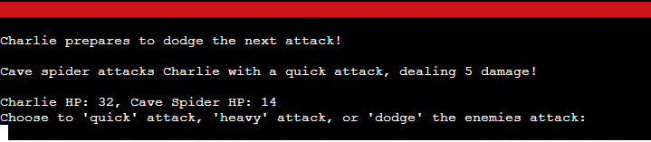

# Subterraneon Script

The project, "Subterranean Script," is my innovative approach to the text-based, choice-driven adventure genre, deeply rooted in the spirit of iconic Choose-Your-Own-Adventure books. It adds a unique twist by plunging players into a sprawling, enigmatic dungeon world, with their destiny dictated by the doors they elect to pass through.

Drawing inspiration from the rich tradition of Dungeons & Dragons, Subterranean Script incorporates a series of well-established rules and mechanics from the legendary tabletop game. This blend of elements aims to enrich the gameplay experience, inviting players to engage with a complex web of decisions that mirror a D&D campaign's depth and dynamism.

At its core, Subterranean Script aims to capture players with its layered, immersive narrative and dynamic choice-driven gameplay, challenging their decision-making skills at every turn. It is meticulously crafted for those who appreciate the immersive allure of traditional text-based games but crave an additional level of interactive mystery and suspense, reminiscent of a well-rounded D&D adventure.

<h2>User Experience Design (UXD)</h2>

<h3>Strategy</h3>

<h4>User Stories</h4>

##### First Time Visitor Goals #####
##### Understanding Gameplay: #####
As a First Time user, I want to easily understand the main concept of the game and its gameplay mechanics.
##### Navigating Commands: #####
As a First Time user, I want to be able to effortlessly navigate through the game commands and decision-making processes.
##### Experiencing Narrative: #####
As a First Time user, I want to experience a compelling introduction to the game world and its narrative.

##### Returning Visitor Goals #####
##### Exploring New Content: #####
As a Returning user, I want to find and explore new paths, narratives, and experiences within the game that deepen my immersion.
##### Understanding Consequences: #####
As a Returning user, I want to see the consequences of my previous choices and understand how they shape my current gameplay.
##### Varied Experiences: #####
As a Returning user, I want the ability to reset the game or make different decisions, enabling varied experiences and outcomes.

#### Frequent Visitor Goals ####
##### Ongoing Adventure: #####
As a Frequent user, I want to continue my ongoing adventure, with the game storing my progress.
##### Updates and Developments: #####
As a Frequent user, I want to see if there are any new updates or developments in the game’s narrative or mechanics.
##### Social Interaction: #####
As a Frequent user, I want to share my gaming experience with others or compare my decisions and game outcomes with them.

<h4>CLI Owner Goals</h4>

##### Engaging Gameplay: #####
As a Command Line Application Owner, I want to offer an intuitive and immersive text-based adventure game that engages users and draws them into its narrative world.
##### User Notification: #####
As a Command Line Application Owner, I want to notify users of new game content or changes, keeping them interested and up-to-date.
##### Gathering Feedback: #####
As a Command Line Application Owner, I want to gather user feedback and experiences, which can be used to refine and expand the game.
##### Community Building: #####
As a Command Line Application Owner, I want to build a community of engaged players who are invested in the game's world and narrative.
##### Showcasing Creativity: #####
As a Command Line Application Owner, I want to be able to showcase the creative team behind the game, to promote their work and foster a deeper connection with the player base.

<h4>Strategy Tradeoffs</h4>

<h3>Scope</h3>

#### Sprint 1 Features ####
- Intro to game
- Player can pick up weapon
- Player can choose a door to progress
- Player can fight an enemy
- Help text to educate the player
#### Sprint 1 Requirement Types ####
- Languages: Python
- Library: [Colorma](https://pypi.org/project/colorama/)

#### Sprint 2 Features ####
- Longer game with more choices
- Sound such as music and attack sounds
#### Sprint 2 Requirement Types ####
- Languages: Python
- Library: [PyAudio](https://pypi.org/project/PyAudio/)

#### Sprint 3 Features ####
- Ability to save
- Adaptive difficulty levels
- Player choices affect other people's games
- Social mnedia presense
- Monetisation
#### Sprint 3 Requirement Types ####
- Languages: Python

    
<h3>Structure</h3>

Touchpoints - Command Line Interface

Whilst the player has the choice of left and right, this choice will be populated by a dictionary. This design will help for expansion in later scripts. In the first sprint I plan to have the first room and then a choice to enter the second room, but this diagram is an example of how it would be in the future.

    
<h3>Surface</h3>

Colours will be based on the [Colorma](https://pypi.org/project/colorama/) library. They will be used to add to the atmosphere of the game.

<h4>Technologies Used</h4>

<h5>Language</h5>

- Python

<h5>Websites, Software & other Tools</h5>

- [Codeanywhere](https://codeanywhere.com/solutions/collaborate) This is was my IDE for the project.
- [CodePen](codepen.io) I used this to test code outside of [Codeanywhere](https://codeanywhere.com/solutions/collaborate) so that I didn't use up hours unnecessarily.
- [Git](https://git-scm.com/) Used to commit and push code to [Github](https://github.com/).
- [Github](https://github.com/) This was used as a remote repository.
- [Heroku](https://heroku.com) I used this to deploy my app.
- [PEP - Python](https://peps.python.org/pep-0008/) This was used to learn more about PEP-8.
- [Python Tutor](https://pythontutor.com/) Used to test logic of my code.
- [Conventional Commits](https://www.conventionalcommits.org/en/v1.0.0-beta.2/) Used to learn and stick to a conventional commit framework.
- [Photoshop](https://www.adobe.com/uk/products/photoshop.html) Used for readme images.

<h2>Features</h2>

<h3>Start Screen</h3>

The Start Screen State serves as the introduction and entry point to the text-based adventure game "Subterranean Script." It's a combination of two phases that guide the player into the game world.

Initialisation Phase (handle_initialise method): This part displays the game's visually engaging ASCII title and presents a welcome message, providing players with a glimpse into the game's mysterious dungeon environment. It hints at the choice-driven nature of the game, inspiring comparisons to classic Choose-Your-Own-Adventure books and Dungeons & Dragons. It also informs the player that they can whisper 'help' at any time to view a list of commands. After presenting this information, the game transitions to the start state.

Start State (handle_start_state method): This state handles the next stage where the player is prompted to enter the game. The player must type 'enter' to proceed, reinforcing the thematic atmosphere of stepping into a dark and unknown world. If the input is valid, a foreboding message wishing the player "Good luck" is displayed, and the game moves to the character creation state. If the player enters anything other than 'enter,' a ValueError is raised, and the shadow-themed error message is printed to guide the player.

Together, these two stages form a cohesive starting experience, introducing players to the tone, setting, and mechanics of the game. The Start Screen State not only welcomes players but also challenges them to take the first step into an adventure filled with choices, mysteries, and uncertainties.

<h3>Name Input State</h3>

The Name Input State is a critical stage in the game where the player is prompted to name their character. This state provides an opportunity for personalisation, setting the tone for the player's relationship with their character.

Valid Name Input: The player must enter a name consisting solely of alphabetic characters, not exceeding 20 characters, and not being 'exit'. If these conditions are met, the character's name is assigned, followed by a reflective print statement that appears to come from the character itself. The game then proceeds to roll and print the character's stats before transitioning to the room pickup state.

Invalid Name Input: If the player's input contains non-alphabetic characters or exceeds 20 characters, a ValueError is raised with an in-game themed error message to guide the player towards a valid name.

By weaving game mechanics with storytelling elements, the Name Input State establishes a connection between the player and their character while maintaining the immersive atmosphere of the game. It ensures that the character naming process is not only a functional requirement but also a meaningful step in the player's journey within the game world.

<h3>Pick Up Object State</h3>

The Pick Up Object State manages the gameplay scenario when a player encounters an object they can collect. In this state, the player is faced with the choice to either 'pick up' or 'leave' the object.

If the player chooses to 'pick up': The method processes a series of actions, such as making the object part of the character's stats and marking it as picked up. An emotional description is printed to engage the player, and the game transitions to the room door choice state.

If the player decides to 'leave': A message is printed reflecting the character's resolve, and the game moves directly to the room door choice state.

For any other input: A ValueError is raised, accompanied by an error message guiding the player to make a valid choice.

This state intricately ties the player's decisions with the game's mechanics and storytelling, enhancing immersion and strategic planning.

<h3>Choose Door State</h3>

The Room Door Choice State represents a crucial juncture in the game where players are faced with the decision to choose between two doors: 'left' or 'right'. This moment encapsulates the essence of choice-driven gameplay, embodying the adventure's core mechanic of branching paths and the unknown consequences that lie beyond each decision.

Making a Choice: The player's input is processed, expected to be either 'left' or 'right'. The chosen direction determines the room they will discover, randomly selected from a predefined set of dungeon areas.

Discovering a Room: Upon making a valid choice, the player's chosen door opens to reveal a room with a specific name and description. This provides flavor text to the scenario, immersing the player in the mysterious dungeon environment and setting the stage for the next challenge.

Transition to the Fight State: The door choice state also includes a prompt that segues into the fight state, the next phase of gameplay where players must confront challenges within the room they've discovered.

Error Handling: If the player's input is anything other than 'left' or 'right', a ValueError is raised, and an atmospheric error message is printed to guide the player. This guidance, framed within the game's shadowy and mystical theme, maintains immersion even in the face of an incorrect choice.

The Room Door Choice State serves as a metaphorical crossroads within "Subterranean Script." It challenges players to make decisions without knowing what lies ahead, echoing the unpredictable and mysterious nature of the game's dungeon environment. By integrating thematic storytelling, user choice, and a transition to further gameplay challenges, this state effectively builds tension and engagement, keeping players invested in their adventure.

<h3>Battle State</h3>

The Battle State within "Subterranean Script" is an intense and dynamic part of the game that pits the player's character against an enemy in a turn-based combat scenario. This state encapsulates the heart-pounding action of the dungeon experience, providing an engaging gameplay loop that challenges the player's decision-making and strategy.

Initialisation: A Fight object is created, and the initiative (who attacks first) is determined between the player and the enemy. Dodge flags are set to False at the beginning, meaning no one is prepared to dodge.

Turn-Based Combat: The battle ensues in turns until either the player or the enemy's hit points reach 0.

Player's Turn: If the player is the attacker, they are prompted to choose between 'quick' attack, 'heavy' attack, or 'dodge'. Each choice has implications for the attack's success, damage dealt, and the likelihood of dodging an incoming attack.
Enemy's Turn: If the enemy is the attacker, a random choice is made between the same set of actions ('quick', 'heavy', 'dodge'), and the chosen action is executed.
Attack Mechanics: The attack method within the Fight class is called to resolve the combat action. The attack's success and damage depend on the type of attack and whether the defender is dodging.

Dodge Mechanics: Both players and enemies can choose to dodge an attack. If successful, this move prevents damage in the following attack. Dodge flags are used to track whether a character is prepared to dodge.

Switching Turns: After each turn, the attacker and defender switch roles, and the dodge flags are reset.

Resolution and Transitions: When the battle ends, victory or defeat messages are printed based on the outcome. Thematic flavor text conveys the aftermath of the battle, enhancing immersion.

Victory: If the enemy is defeated, a victory message emphasises the intensity of the battle and hints at the mysterious nature of the dungeon.
Defeat: If the player is defeated, a defeat message conveys the dramatic end and the triumph of the enemy.
Game Reset: After the fight concludes, the game resets, and the player is transitioned back to the character creation state, allowing them to start anew.

The Battle State's complexity and depth lie in the interplay between choice and randomness, strategy, and adaptability. By weaving together mechanics of attack, dodge, and turn-based dynamics, this state creates a thrilling and unpredictable combat experience. The detailed feedback and atmospheric text further deepen the immersion, making each battle a memorable and integral part of the overall dungeon adventure.

<h3>Help and Universal Commands</h3>

Within "Subterranean Script," the player might need guidance on their available options or access to certain universal commands that are applicable across different game states. These functionalities are managed by two distinct methods: print_help and handle_universal_commands.

1. Help State (print_help method)
The Help State provides contextual assistance to players, offering tailored guidance based on the current and previous states of the game.

Basic Structure: The method begins with a thematic introduction, signaling that the player is seeking assistance from the shadows of the dungeon. It then provides general commands like 'Return' and 'Exit'.
Contextual Guidance: Depending on the player's location or situation within the game, specific commands and information are provided. These might include navigation options, combat actions, character creation instructions, etc.
Return to Gameplay: The help text encourages players to 'Return' to resume their previous action or to explore additional options pertinent to their current situation.
The help text effectively serves as a dynamic guide, adjusting its content to match the player's needs at any given point in the game.

2. Universal Commands State (handle_universal_commands method)
The Universal Commands State handles common commands that can be invoked in various game states, adding consistency and flexibility to the player's control scheme. The recognised universal commands include:

- 'help': Transitions to the Help State, where players receive information on available commands based on their current situation.
- 'stats': If the player's name has been initialised, this command displays the character's statistics and provides the option to 'return' to the previous state.

- 'exit': Allows the player to exit the game with a thematic farewell message.
- 'return': Enables the player to return to the previous state from the 'help' or 'stats' screens, ensuring a smooth navigation experience.

These universal commands add an extra layer of accessibility and usability, allowing players to call upon essential functions from nearly any point in the game.

<h3>Built to be Scalable</h3>

The scalability of the project is largely derived from the thoughtful use of data structures, such as dictionaries to contain entities like enemies and dungeon areas, and classes to represent characters and enemies. By organising data into well-defined structures, it will easier to manage, expand, and modify various aspects of the game, as detailed below:

1. Integration with Classes:
My project's use of classes for character and enemy modelling complements the dictionary-based approach. Classes encapsulate behaviours, making it easy for me to define how characters interact with objects or enemies. By combining classes with rich data structures, I've set the project to offer seamless integration of content and logic, making the system adaptable and scalable.

2. Making Enemies Feel Different:
The current structure of the enemy dictionary sets the stage for customisation, allowing for further differentiation among enemies. Here's how I can accomplish this:

Behavioural Patterns: By implementing different AI behaviours or attack patterns for various enemy types, I can create a more diversified combat experience. This can be done by adding methods to the enemy class or adding attributes to the dictionary that describe specific actions or responses in given situations.

Visual Representation: I can associate different sprites or visual effects with different enemies. By linking an image or visual identifier to each enemy in the dictionary, I can render unique appearances for each creature quickly.

Sound Effects: Integrating unique sounds for different enemies can enhance the immersive experience. Associating specific audio files or sound effects with particular enemies in the dictionary can achieve this.

Special Abilities: Introducing unique abilities or special attacks for specific enemies can make encounters more engaging. Adding an "abilities" list to the enemy dictionaries and implementing corresponding methods in the enemy classes will allow for this differentiation.

3. Room Definition:
Another use of dictionaries can be found in defining the dungeon's rooms within my project. I've structured the ROOMS dictionary in layers, with each room possessing specific attributes like "name," "description," and "prompt." This layered approach enables me to add new rooms or modify existing ones easily, allowing for the dynamic scaling of the dungeon as the game evolves.

4. Object Management:
I've also used dictionaries to manage objects that can be found in different layers of the dungeon. These objects have specific attributes like "name" and "description," and even stat changes, making them vital to the gameplay. By organising these objects within dictionaries, I've made it simple to add new items or modify existing ones without altering the core game code.

<h2>Bugs</h2>

<h3>Known Bugs</h3>

<h3>Fixed Bugs</h3>

- [Capitals would break the code](https://github.com/CharlieMcGoldrick/ci-ms3-subterranean-script/commit/e0b020b549f640894155544333df3c019e52df51) - I added the `.lower()` method so that errors aren't raised if the player types in capitals.
- [While loop when starting game](https://github.com/CharlieMcGoldrick/ci-ms3-subterranean-script/commit/5f8982a29fd6b20bbdea8996b0b84b698e3fdbcb) - Start screen was stuck in an infinite loop due to being in `While True:`.
- [ASCII escape sequence](https://github.com/CharlieMcGoldrick/ci-ms3-subterranean-script/commit/ebc8f6959027033d0721d9ec553968c33d7ca977) - I added more characters to ensure the 'escape sequence' error wasn't displayed, whilst maintaing the shape of the text.
- [Ensure player can't enter stat state until a certain point](https://github.com/CharlieMcGoldrick/ci-ms3-subterranean-script/commit/cb7907dcd04ec04c59e6e82bfa6fb98123a42f0e) - Add logic so that the `stat` state can't be entered.
- [Inifnite Loop](https://github.com/CharlieMcGoldrick/ci-ms3-subterranean-script/commit/fced12a8a11efee073fada6819e530a2951ce7aa) - Conditional was looking for words with uppercase first letters, but the input was being converted to lowercase so there was a loop. Changing these words to be lowercase fixed this.
- [Flavour text appearing after user input](https://github.com/CharlieMcGoldrick/ci-ms3-subterranean-script/commit/a97b74195755d1d993146e209c102fc78dac0706) - Moved the order of the flavour text.
- [Weapon wasn't being randomly selected](https://github.com/CharlieMcGoldrick/ci-ms3-subterranean-script/commit/f1fe7925198d443264353799247d5a07fc341112) - `weapon_choice` was getting applied in the `get_prompt method`, so I changed it to being handled in the `handle_room_pickup` method.
- [Weapon generated multiple times](https://github.com/CharlieMcGoldrick/ci-ms3-subterranean-script/commit/0d4f7f5ec4bac23a2459069b4d0f15dd57b67075) - Weapon was being generated multiple times if the user went back to the `ROOM_PICKUP_FIRST_LAYER`, so I changed it to only generate a weapon from the dictionary randomly if the `self.object.choice` hadn't been made.
- [Unreachable and redundant code](https://github.com/CharlieMcGoldrick/ci-ms3-subterranean-script/commit/417a5cea6fd87bb1521b6d7d1e77e91a97e5d87d) - Code was unreachable and actually redundant, so I removed it.
- [Unnecessary code in regards to Stat Rolling](https://github.com/CharlieMcGoldrick/ci-ms3-subterranean-script/commit/df7528a81abbf576860b97454e248ec77f981560) - Removed unnecessary assignment of rolled stats. The method now directly modifies the character's attributes.
- [Handle invalid room pickup input](https://github.com/CharlieMcGoldrick/ci-ms3-subterranean-script/commit/b7585022bccd4cb787bc990a1f139ef83a3b0bd2) - Added error handling in the `handle_room_pickup` method to gracefully handle situations when the user enters an invalid choice. Instead of raising an exception, it now prints a meaningful error message, guiding the user to make a valid choice.
- [Weapon assignment in room pickup](https://github.com/CharlieMcGoldrick/ci-ms3-subterranean-script/commit/cead17bf4779ec30fefecf7d0815be913df837cf) - Removed the unnecessary use of `self` in object choice during room pickup handling. The weapon assignment now directly uses the randomly chosen object, ensuring that the character's weapon is correctly assigned.
- [Stat changes not being applied](https://github.com/CharlieMcGoldrick/ci-ms3-subterranean-script/commit/614e8d3a0144da6d749860ffd60b5d67b24a5d2e) - Stat changes from picking up objects were printing initially but weren't actually getting applied, so printing stats again wouldn't show them. Added attribute to ensure this is something that can be tracked throughout the game.
- [Redunant .lower method](https://github.com/CharlieMcGoldrick/ci-ms3-subterranean-script/commit/d7956f94b99c12d2dd1233e4d7ef59cbdcc29406) - The `.lower()` method is being handled elsewhere so having the method elsewhere for the `user_input` was redundant.
- [Add try/except block to room choice](https://github.com/CharlieMcGoldrick/ci-ms3-subterranean-script/commit/3363410c66ce07cd5e2a4bda9eda0c2a57a8be2d) - Added a try/except block to handle user inputs.
- [Printed lines above 24](https://github.com/CharlieMcGoldrick/ci-ms3-subterranean-script/commit/c18c49435b2959074893ce38bace913296c6c6af) - I removed some of the flavour text so that the printed lines didn't exceed 24 lines.
- [Varied naming convention](https://github.com/CharlieMcGoldrick/ci-ms3-subterranean-script/commit/ed4f748ee9f7341934b93740170027d0cc4287b6) - I had `type` instead of `entity_type`, in my enemies.py file. I added entity_ so that the naming convention is consistent.
- [Enemies spawning incorrectly due to room choice handling](https://github.com/CharlieMcGoldrick/ci-ms3-subterranean-script/commit/e3b63be6d469bc4d8929ae7bee2fb2d8cc583e5e) - Replaced `room_choice` with `room_choice_name' and `room_choice_dict` to correctly handle the room selection. Also modified the `specific_enemy` retrieval to correctly access the specific enemy according to the current room.
- [Update battle handling logic](https://github.com/CharlieMcGoldrick/ci-ms3-subterranean-script/commit/37d37bcff1d74ed041feee5be545f0245d62daa9) - Add appropriate code so if an enemy doesn't already exist, it generates a new one based on the current room's name. Then, it initiates or continues the battle by calling the handle_battle method with the user's input, player character, and the enemy instance.
- [Ensure battle logic loops based on user input](https://github.com/CharlieMcGoldrick/ci-ms3-subterranean-script/commit/9499e090b9b2c26d6605bbce13e1ab7d8c867fb6) - The battle logic would play out until one of the entities died, so I added user_input to be within the correct logic so that each phase of the battle waits for `user_input`.
- [Unwanted user prompt in transition to fight state](https://github.com/CharlieMcGoldrick/ci-ms3-subterranean-script/commit/0ea1c9062d7a751365e78b5a09b1a9ba16a38956) - Modified the main loop in the `class Game` to only prompt for user input when required based on the current game state. This fixes an issue where an extra newline was being printed when transitioning to the fight state, requiring the user to press enter before the fight started. Now, the fight prompt is printed directly to the console without requiring additional input from the user.
- [Inf loop in battle func by resetting userinput](https://github.com/CharlieMcGoldrick/ci-ms3-subterranean-script/commit/81910a4995aed8eb8789c1a88a2f96039474cbd4) - The infinite loop issue in the battle function was caused by the persistence of the `user_input` throughout the loop iterations. If the player chose to dodge once, the `defender_dodging` would always evaluate to `True` for all subsequent enemy turns.
- [Entities health being double printing](https://github.com/CharlieMcGoldrick/ci-ms3-subterranean-script/commit/86b97b2d3f86e10d7435026bd6d9e1f55b55c28e) - Moved the print statement for player and enemy HP outside the nested conditionals in the `handle_battle` method. This ensures that the HP values are printed only once per turn, correcting the previous behavior where they were printed twice when the dodge command was input.
- [Missing parenthesis in battle func](https://github.com/CharlieMcGoldrick/ci-ms3-subterranean-script/commit/20c33764b2c13cbad940e516cd426175c7746d30) - A missing parenthesis was found in the handle_battle function, which led to a syntax error.
- [Ensure proper handling of dodging](https://github.com/CharlieMcGoldrick/ci-ms3-subterranean-script/commit/b3c7cdd0114e6a10401b7eacbebd54f0955aeba3) - When dodge was typed the player would sometimes attack so I added flag to ensure this doesn't happen.
- [Ensure object choice persits once chosen](https://github.com/CharlieMcGoldrick/ci-ms3-subterranean-script/commit/43b0ed2d7e72e1ed48bb0fb618b241c68c07abc3) - In the original code, the object choice was randomly selected but not consistently referenced throughout the function, leading to potential inconsistencies in the user experience.
- [Ensure reference to enemy is correct in battle func](https://github.com/CharlieMcGoldrick/ci-ms3-subterranean-script/commit/b3c7cdd0114e6a10401b7eacbebd54f0955aeba3) - I was referencing the `enemy_instance` in my code instead of `enemy`.
- [Ensure player doesn't get stuck in loop](https://github.com/CharlieMcGoldrick/ci-ms3-subterranean-script/commit/4c40ac1b707297ccd7f2a3cce86d80a3b7bcb60e) - If the user went into the help state and then into the stat state and typed return they would go back to the help state but then return would move them back to the stat state, and so on. So I changed the way general game states states are handled to stop this from happening.

<h2>Python Validation</h2>

I used the [PEP-8 Validator](https://pep8ci.herokuapp.com/) to validate the Python code used in this application. Below you can see the success of each file in the project.

<h3>run.py</h3>

<h3>game_states.py</h3>

<h3>dungeon_areas.py</h3>

<h3>enemies.py</h3>

<h3>objects.py</h3>

<h3>utilities.py</h3>

<h2>Deployment</h2>

***Clone a GitHub Repository***
To make a clone of this repository, follow these steps:
Login to your GitHub account.
1. Go to the repository by visiting the link: [Charlie McGoldrick Github - Subterranean Script Repo](https://github.com/CharlieMcGoldrick/ci-ms3-subterranean-script).
2. Click the "Code" button and then use the copy button next to the link to copy the link.
3. In your IDE of choice, open a new terminal and use the following clone command: git clone `https://github.com/CharlieMcGoldrick/ci-ms3-subterranean-script`.
4. You will now have a copy of the repository in you local version.

***Forking the GitHub Repository***
To fork this repository, follow these steps:
1. Log in to your GitHub account.
2. Go to the repository you want to fork, which is located at: [Charlie McGoldrick Github - Subterranean Script Repo](https://github.com/CharlieMcGoldrick/ci-ms3-subterranean-script).
3. In the top-right corner of the repository page, click on the "Fork" button
4. GitHub will prompt you to select where you want to fork the repository. Choose your personal account or organization.
5. Wait for the forking process to complete. Once it's done, you will be redirected to your forked repository under your GitHub account.

NOTE: Any changes pushed to the main branch automatically show up on the website.

***Heroku***
To host the app, I used Heroku. Follow the steps below for deployment:
1. Clone or fork [Charlie McGoldrick Github - Subterranean Script Repo](https://github.com/CharlieMcGoldrick/ci-ms3-subterranean-script).
2. Log into your Heroku account.
3. Click the *New* button and then click *Create new app*.
4. Give the app a name, choose your desired region and click the *Create app* button.
5. Navigate to *Settings* and click *Add buildpack*.
6. Add *Python* and then *Nodejs*.
7. Navigate to the *Deploy* tab and choose your *Deployment method*.
8. Find the repository you want to use.
9. Choose the correct branch
10. Click the *Deploy Branch* button

NOTE: You might want to turn on *Enable Automatic Deploys*

<h2>Credits</h2>

- [Python Docs](https://docs.python.org/3/) Used to learn more about Python.
    - [Python Docs - Random](https://docs.python.org/3/library/random.html) For help with the random module.
    - [Python Docs - Exceptions](https://docs.python.org/3/library/exceptions.html) For help with try/except syntax.
    - [Python Docs - @staticmethod](https://docs.python.org/3/library/functions.html#staticmethod) For help with @staticmethod.
    - [Python Docs - Super](https://docs.python.org/3/library/functions.html#super) For help with super proxy object.
- [NumPy](https://numpydoc.readthedocs.io/en/latest/format.html) For help with NumPy Style Docstrings.
- [Colorama](https://pypi.org/project/colorama/) For help with Colorama Syntax.

<h2>Acknowledgements</h2>

- Thank you to my mentor; Graeme Taylor and Code Institute (including the Slack community), for the great support, advice, and guidance.
- Thank you to my friends and family for their patience and understanding whilst working on this project.

