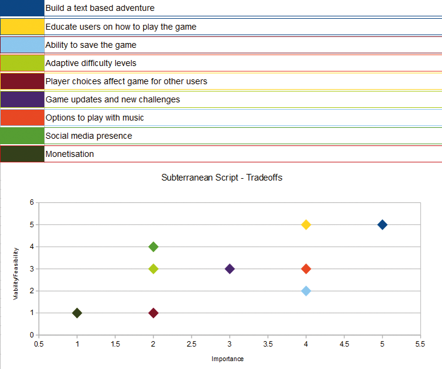

# Subterraneon Script

The project, "Subterranean Script," is my innovative approach to the text-based, choice-driven adventure genre, deeply rooted in the spirit of iconic Choose-Your-Own-Adventure books. It adds a unique twist by plunging players into a sprawling, enigmatic dungeon world, with their destiny dictated by the doors they elect to pass through.

Drawing inspiration from the rich tradition of Dungeons & Dragons, Subterranean Script incorporates a series of well-established rules and mechanics from the legendary tabletop game. This blend of elements aims to enrich the gameplay experience, inviting players to engage with a complex web of decisions that mirror a D&D campaign's depth and dynamism.

At its core, Subterranean Script aims to capture players with its layered, immersive narrative and dynamic choice-driven gameplay, challenging their decision-making skills at every turn. It is meticulously crafted for those who appreciate the immersive allure of traditional text-based games but crave an additional level of interactive mystery and suspense, reminiscent of a well-rounded D&D adventure.

<h2>User Experience Design (UXD)</h2>

<h3>Strategy</h3>

<h4>User Stories</h4>

##### First Time Visitor Goals #####
##### Understanding Gameplay: #####
As a First Time user, I want to easily understand the main concept of the game and its gameplay mechanics.
##### Navigating Commands: #####
As a First Time user, I want to be able to effortlessly navigate through the game commands and decision-making processes.
##### Experiencing Narrative: #####
As a First Time user, I want to experience a compelling introduction to the game world and its narrative.

##### Returning Visitor Goals #####
##### Exploring New Content: #####
As a Returning user, I want to find and explore new paths, narratives, and experiences within the game that deepen my immersion.
##### Understanding Consequences: #####
As a Returning user, I want to see the consequences of my previous choices and understand how they shape my current gameplay.
##### Varied Experiences: #####
As a Returning user, I want the ability to reset the game or make different decisions, enabling varied experiences and outcomes.

#### Frequent Visitor Goals ####
##### Ongoing Adventure: #####
As a Frequent user, I want to continue my ongoing adventure, with the game storing my progress.
##### Updates and Developments: #####
As a Frequent user, I want to see if there are any new updates or developments in the game’s narrative or mechanics.
##### Social Interaction: #####
As a Frequent user, I want to share my gaming experience with others or compare my decisions and game outcomes with them.

<h4>CLI Owner Goals</h4>

##### Engaging Gameplay: #####
As a Command Line Application Owner, I want to offer an intuitive and immersive text-based adventure game that engages users and draws them into its narrative world.
##### User Notification: #####
As a Command Line Application Owner, I want to notify users of new game content or changes, keeping them interested and up-to-date.
##### Gathering Feedback: #####
As a Command Line Application Owner, I want to gather user feedback and experiences, which can be used to refine and expand the game.
##### Community Building: #####
As a Command Line Application Owner, I want to build a community of engaged players who are invested in the game's world and narrative.
##### Showcasing Creativity: #####
As a Command Line Application Owner, I want to be able to showcase the creative team behind the game, to promote their work and foster a deeper connection with the player base.

<h4>Strategy Tradeoffs</h4>

<h3>Scope</h3>

#### Sprint 1 Features ####
- Intro to game
- Player can pick up weapon
- Player can choose a door to progress
- Player can fight an enemy
- Help text to educate the player
#### Sprint 1 Requirement Types ####
- Languages: Python
- Library: Colorama

#### Sprint 2 Features ####
- Longer game with more choices
- Sound such as music and attack sounds
#### Sprint 2 Requirement Types ####
- Languages: Python
- Library: PyAudio

#### Sprint 3 Features ####
- Ability to save
- Adaptive difficulty levels
- Player choices affect other people's games
- Social mnedia presense
- Monetisation
#### Sprint 3 Requirement Types ####
- Languages: Python

    
<h3>Structure</h3>

Touchpoints - Command Line Interface

Whilst the player has the choice of left and right, this choice will be populated by a dictionary. This design will help for expansion in later scripts. In the first sprint I plan to have the first room and then a choice to enter the second room, but this diagram is an example of how it would be in the future.

